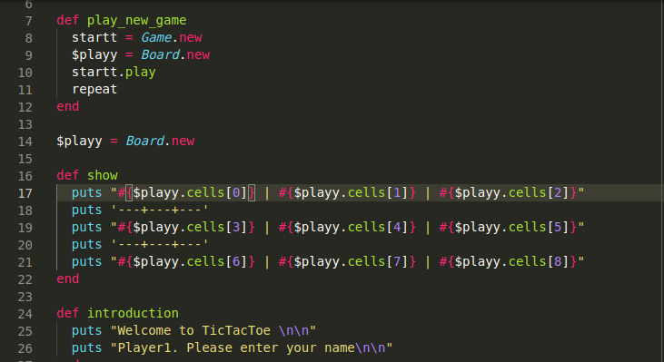

# Week 2  TicTacToe

## Screenshot

## Built With

- Ruby
- Linters
- OOP

## Getting Started

First ensure that you have ruby installed on your local machine.
To get a local copy up and running follow these simple example steps.

## Prequisites

Ruby installed on your local machine.
Code editor (like VSCode)
Terminal or similar to execute the program.

## Install

Download a copy of the TicTacToe repository

## Usage

- To play the game, open the terminal and direct yourself to the main folder root of TicTacToe.
- Once you are in the main root file, enter in the terminal the command: ruby bin/main.
- Follow the game instructions

## Instructions

 Once the game has started
 1. The first player places their name
 2. The First player needs to select a symbol from X or O
 3. The Second player needs to enter their name
 4. Symbol for the second player is assigned automatically
 5. Game starts - Makes player1 choose a section and place his symbol (1-9)
 6. If the number you entered is already taken, you will be forced to choose again.
 7. Player 2 will now select a space in the board to place the symbol (the same rules apply as step 6)
 8. Players need to obtain a winning combo using their symbol (CHECK BELOW FOR WINNING COMBOS)
 9. If none of the players can get a winning combo, the game will simply draw with no winners. 
 10. The game will prompt you to play once again: press "ok". Or to end the game: press "no"
 11. Enjoy
 
 ## Board:  
 
 |1| |2| |3|
 -----------
 |4| |5| |6|
 -----------
 |7| |8| |9|
 -----------

## Winning combos:
# 1

 |X| |X| |X|  
 -----------
 |4| |5| |6|  
 -----------
 |7| |8| |9|
 -----------

 # 2

 |1| |2| |3|
 -----------
 |X| |X| |X|
 -----------
 |7| |8| |9|
 -----------

# 3

 |1| |2| |3|
 -----------
 |4| |5| |6|
 -----------
 |X| |X| |X|
 -----------

# 4

 |X| |2| |3|
 -----------
 |X| |5| |6|
 -----------
 |X| |8| |9|
 -----------

# 5

 |1| |X| |3|
 -----------
 |4| |X| |6|
 -----------
 |7| |X| |9|
 -----------

# 6

 |1| |2| |X|
 -----------
 |4| |5| |X|
 -----------
 |7| |8| |X|
 -----------

# 7

 |1| |2| |X|
 -----------
 |4| |X| |6|
 -----------
 |X| |8| |9|
 -----------

# 8

 |X| |2| |3|
 -----------
 |4| |X| |6|
 -----------
 |7| |8| |X|
 -----------

## Authors

👤 Sergio Cortes Satizabal

- GitHub: [@githubhandle](https://github.com/sergiocortessat)
- Twitter: [@twitterhandle](https://twitter.com/sergiocortessat)

👤 Ari Karim

- GitHub: [@githubhandle](https://github.com/arikarim)
- Twitter: [@twitterhandle](https://twitter.com/Ari71549490)

## 🤝 Contributing

Contributions, issues, and feature requests are welcome!

Feel free to check the [issues page](https://github.com/sergiocortessat/Ruby-Milestone1-BubleSort/issues).

## Show your support

Give a ⭐️ if you like this project!

## Acknowledgments

- Hat tip to anyone whose code was used
- Inspiration
- etc

## 📝 License

This project is [MIT](LICENSE) licensed.
